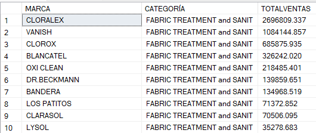
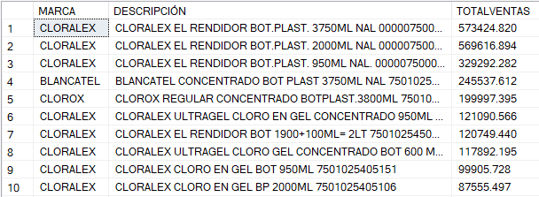
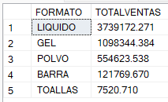
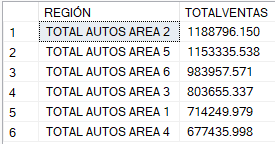
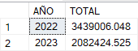
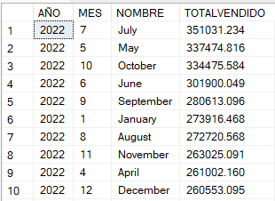

<h2>🟡 Descripción general:</h2>
 
Este repositorio contiene la propuesta de un modelo de base de datos diseñado para almacenar una muestra de datos con fines educativos de la empresa Reckitt.
A partir de este modelo se realizaron consultas SQL que permiten combinar diferentes tablas y obtener insights clave sobre la información disponible. 
El objetivo es facilitar la comprensión de cómo estructurar una base de datos relacional y aplicar consultas analíticas para extraer información relevante.</a>

  
<h2>⚙️Tecnologías: </h2>
 
    • SQL Server  
    • Wondershare EdrawMax  
  

<h2>🖇️ Fuente: </h2> 
⭐ EBAC - Escuela británica de artes creativas y tecnología.
 
  
<h2>🧩 Tablas creadas:</h2
 
• Sales (ID_SALE, ITEM_CODE, TOTAL_UNIT_SALES, TOTAL_VALUE_SALES, SALE_DATE, ID_REGION). 
• Products (ITEM_CODE, ITEM_DESCRIPTION, ID_BRAND, ID_CATEGORY, ID_FORMAT). 
• Brands (ID_BRAND, BRAND, MANUFACTURER). 
• Category (ID_CATEGORY, CATEGORY). 
• Formats (ID_FORMAT, FORMAT_NAME, ATTR1, ATTR2, ATTR3, ID_CATEGORY, ID_SEGMENT) 
• Segment (ID_SEGMENT, SEGMENT). 
• Region (ID_REGION, REGION_NAME). 
 
 
 
<h2>📊 Actividades: </h2>
 
  • Creación de modelo de datos lógico y físico (base de datos relacional).
  • Importación de datos.  
  • Consultas a la base de datos para extraer información en un contexto empresarial. 
 
 
<h2>Diagrama Entidad - Relación</h2>
 

  
<h2>Consultas realizadas: </h2>
 
▫️Ventas por categoría  

   
▫️Ventas por descripción del producto  

   
▫️Ventas por formato de producto  

   
▫️Ventas por región   

   
▫️Ventas por año  

   
▫️Ventas por mes  

   
<h2>🔶 Observaciones generales:</h2>
 
• El periodo analizado comienza en enero de 2022 y termina en julio 2023, razón por la cual el año con más ventas ha sido 2022.  
• Los productos más vendidos fueron Cloralex, Vanish y Clorox, siendo Cloralex en su presentación de botella 3.750 ml la más vendida.  
• Los formatos más vendidos fueron líquido, gel y polvo.
 

